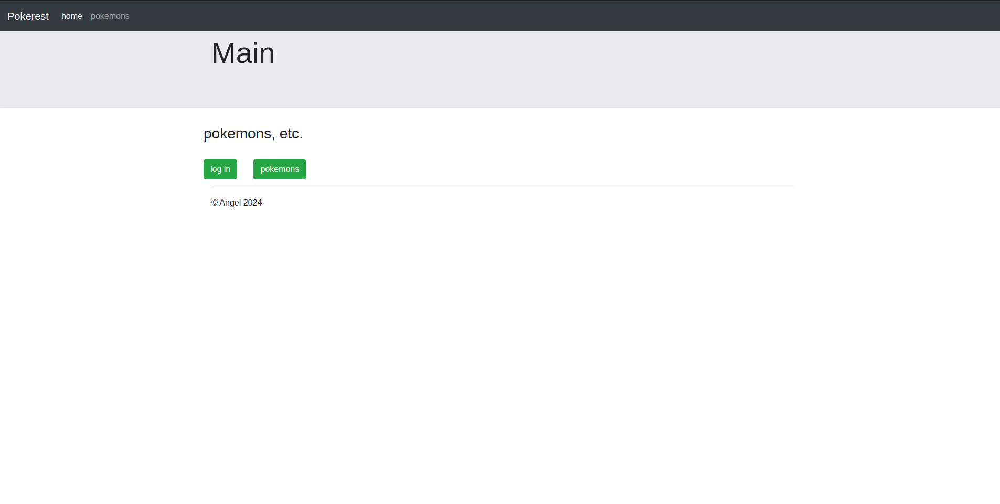
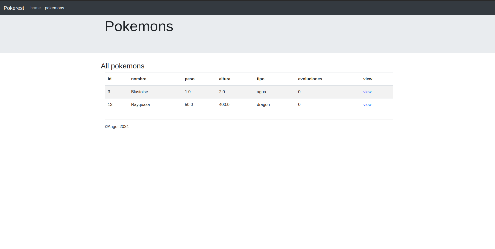
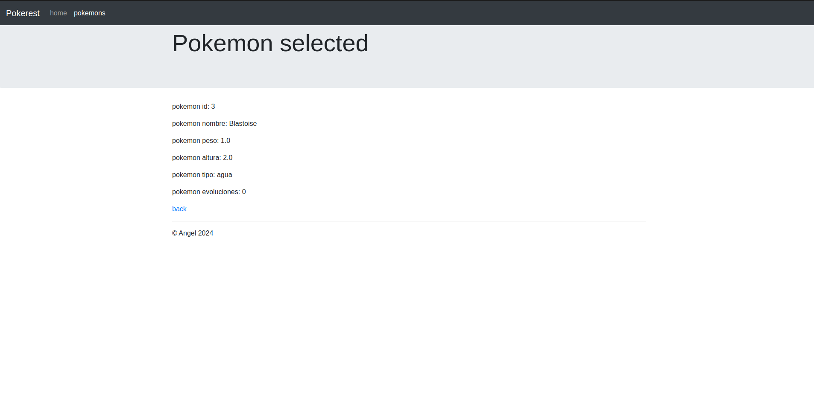
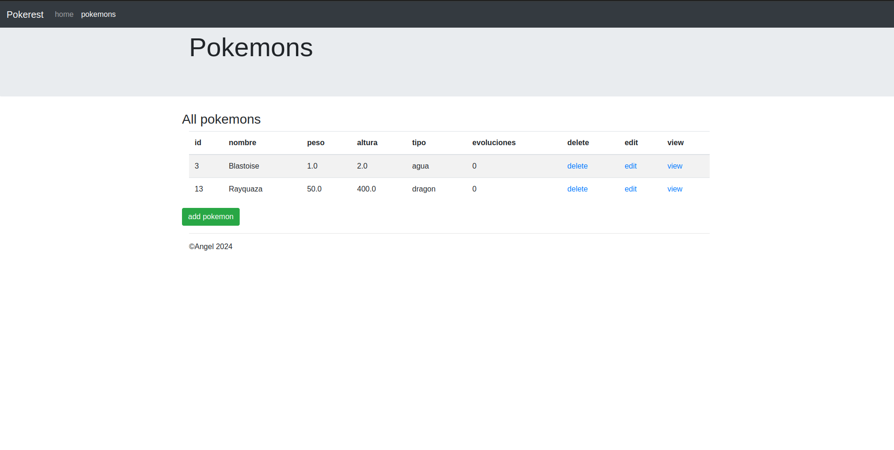
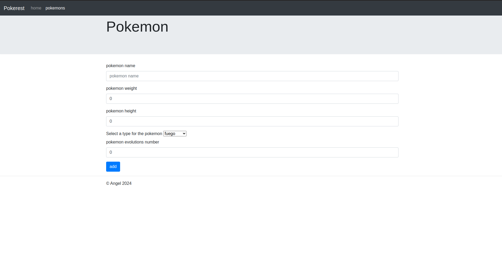
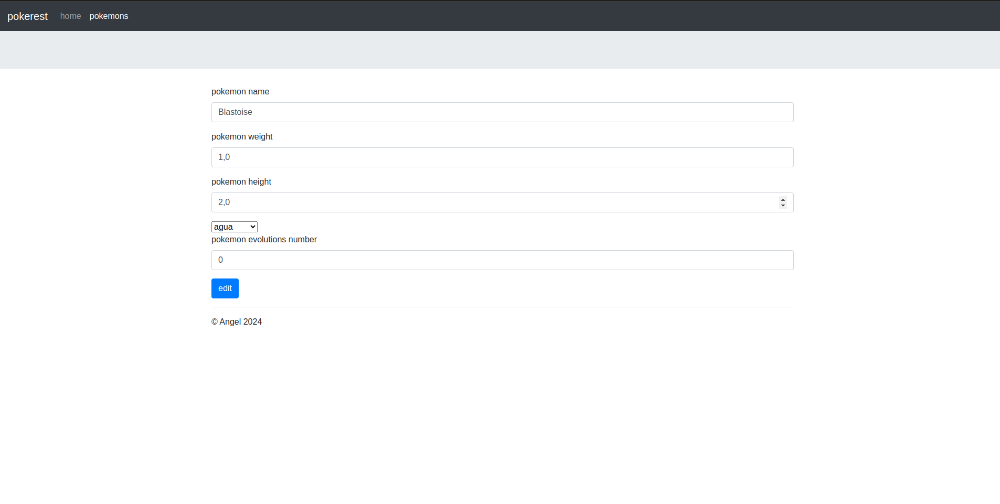
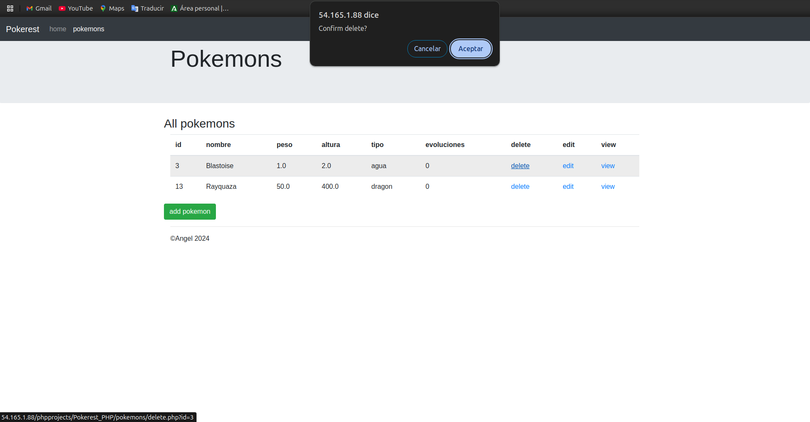
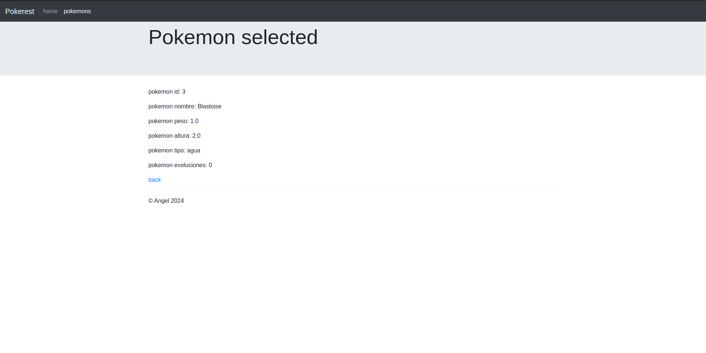

## Este proyecto consiste en una aplicacion que contendra datos de pokemon y estará hecha en php puro.

##### Vista principal de la aplicacion

En esta vista principal se incluye un login muy basico  para que cada usuario se pueda loguear de manera facil y un boton que te permite 
ver todos los pokemons(estes logueado o no). 

Ademas se incluye un nav de navegacion básico tambien.

#### Index de los pokemons para un usuario no logueado

Si el usuario no esta logueado le aparecerán los pokemons pero no podrá realizar ninguna operación salvó la de ver(view) mas de cerca el pokemon de la base
de datos:

#### Index de los pokemons para un usuario logueado

Si el usuario esta logueado vemos que le aparecen los datos del pokemon y ademas 3 campos con los que puede eliminar(delete) al pokemon,
editar(edit) al pokemon o tener una vista(view) mas profunda de este.

Ademas se nos incluye un boton para añadir pokemons nuevos.

#### Pagina de creación de un pokemon

En la pagina de creación como podéis apreciar aparece una form con los campos que va a tener un pokemon(name, height, etc.)

En la etiqueta select para elegir los diferentes tipos del pokemon los datos los obtengo de mi base de datos, para asegurarme de que un usuario
puede introducir su pokemon de manera adecuada sin tener que estar metiendo los datos de los tipos a mano.

#### Pagina de edición de un pokemon

En la pagina de edicion como se puede apreciar aparecen los datos del pokemon seleccionado para que nos sea mas facil modificarlo.

**NOTA: Tanto en la sección de edición como de creación estamos controlando que el pokemon a insertar no exista previamente en la base de datos mediante una validación que realizamos en el store.php. Además tambien cuando uno de estos errores se produce utilizamos el array asociativo $_SESSIONS para guardar los valores que hubiera insertado el usuario y no tenga que estar metiendo de manera repetitiva los datos que ya tenía introducidos previamente**

#### Eliminación de un pokemon 

Para la eliminación de un pokemon utilizaremos JavaScript para que nos muestre una ventanita que servirá para que el usuario nos confirme la eliminación del pokemon si de verdad quiere hacerlo.

#### Vista en profundidad del pokemon con usuario logueado(No cambia respecto al no logueado):

## Author: Jose Ángel Macías Aguilera.